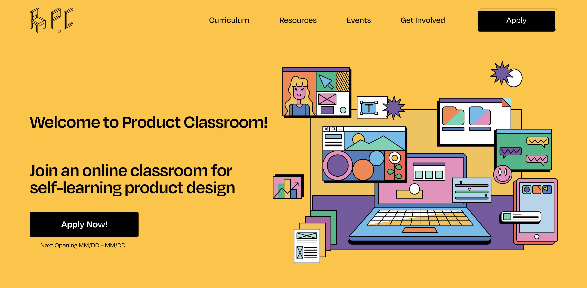

# ProductClassroom

### Welcome to Product Classroom!

We are a virtual community made by students for students to self-learn product design!



## Design

Design done in [Figma](https://www.figma.com/file/j8x4p6uX4MpyxLZYfbhKoU/WebDev?node-id=116%3A2).

## Organization

All the elemets that are in the website are organized in the following folders:

- [css](#css) - SCSS files used in the website
- [js](#js) - JS files used in the website
- [img](#images) - Images contained in the website
- [doc](https://github.com/VictorBis/ProductClassroom/tree/main/doc) - Contains the curriculums PDF's
- [favicon](https://github.com/VictorBis/ProductClassroom/tree/main/favicon) - Contains all the icons that are needed to show a favicon in the different browsers
- [Pages](#page-templates) - Every page in the website is in its own folder

---

## CSS

#### Style

The [style file](https://github.com/VictorBis/ProductClassroom/blob/main/css/style.scss) is the main style file, it contains the links to the styles used in the website.

#### Global

The [global file](https://github.com/VictorBis/ProductClassroom/blob/main/css/_global.scss) contains the styles that are used in multiple pages in the website.

<details>
<summary>Important classes</summary>

- **.primary-btn bg-yellow** Main button (displayed in the nav bar) with a yellow background
- **.btn** Button displayed in th rest of the website
- **.btn secondary** Secondary button

</details>

#### Colors

All the colors in the website are defined in the [\_colors.scss](https://github.com/VictorBis/ProductClassroom/blob/main/css/_colors.scss) file. By changing the value of one of them, the color will be updated automatically in the whole website.

<details>
    <summary>Defined colors</summary>

```css
$yellow: #f9c449;
$orange: #fc8746;
$red: #fd624d;
$pink: #ef91bf;
$purple: #b461a2;
$darkpurple: #7758a3;
$lightblue: #b0d8f0;
$blue: #5bbfeb;
$darkblue: #497ebf;
$lightgreen: #9ce9d4;
$green: #65d6b6;
$darkgreen: #0bba85;
$black: #000000;
$white: #ffffff;
```

</details>

#### Typography

All the sizes and styles of the typography in the website are defined in the [\_typography.scss](https://github.com/VictorBis/ProductClassroom/blob/main/css/_typography.scss) file. The styles are defined as classes, and need to be defined in the HTML to be applied.

<details>
<summary>Example</summary>

```html
<p class="medium-19">
  This is a paragraph with font size 19 and medium weight.
</p>
```

</details>

#### Cards

The [cards file](https://github.com/VictorBis/ProductClassroom/blob/main/css/_cards.scss) contains the styles of the different cards that are display in the website.

<details>
<summary>Defined classes</summary>

- **.colored-cards** - Cards used for [curriculum weeks](https://productclassroom.us/Curriculum/) and [FAQ's](https://productclassroom.us/FAQ/)
- **.case-study** - Cards for the case studies
- **.lecturer-speaker-small** - Cards for mentors that are displayed in the [Home page](https://productclassroom.us)
- **.member** - Cards for product classroom admins
- **.final-cta** - Cards displayed as the final CTA in the website
- **.lecturer-card** - Cards for the mentors displayed in the [Classroom Advisors page](https://productclassroom.us/ClassroomAdvisors/)
- **.accordion-container** - Cards for the options showed in the [Get Involved page](https://productclassroom.us/GetInvolved/)
</details>

#### Nav

The [nav file](https://github.com/VictorBis/ProductClassroom/blob/main/css/_nav.scss) contains the styles for the nav bar in desktop.

#### Mobile nav

The [mobile nav file](https://github.com/VictorBis/ProductClassroom/blob/main/css/_mobilenav.scss) contains the styles for the nav bar in mobile.

#### Footer

The [footer file](https://github.com/VictorBis/ProductClassroom/blob/main/css/_footer.scss) contains the styles for the footer.

#### Home

The [home file](https://github.com/VictorBis/ProductClassroom/blob/main/css/_home.scss) contains the styles for the hero section.

## JS

The files contained in this folder make possible the funtionality of the mobile menu and aacordion, they must not be changed.

## Images

All the images conatined in the website should be placed in its corresponding folder to keep the defined organization.

**Important**: Before adding an image (png, jpg, jpeg, etc.) try to reduce the size of it as much as possible using tools such as [tinypng](https://tinypng.com), [compress jpeg](https://compressjpeg.com), [iloveimg](https://www.iloveimg.com/compress-image), or anyone you prefer.

<details>
<summary>Folders</summary>

- [CaseStudies](https://github.com/VictorBis/ProductClassroom/tree/main/img/CaseStudies) - Case studies thumbnails and past students photos.
  - [Classmates](https://github.com/VictorBis/ProductClassroom/tree/main/img/CaseStudies/Classmates) - Past students photos.
- [Events](https://github.com/VictorBis/ProductClassroom/tree/main/img/Events) - Event to be displayed. The event thumbnail should replace th current one in the [Figma file](https://www.figma.com/file/j8x4p6uX4MpyxLZYfbhKoU/WebDev?node-id=116%3A2), be exported as PNG with the name _Events-Thumbnail.png_ and placed in this folder, so it'll be automatically replaced in the website.
- [Icons](https://github.com/VictorBis/ProductClassroom/tree/main/img/Icons) - Icons used in this webstie, they should be SVG.
- [Illustrations](https://github.com/VictorBis/ProductClassroom/tree/main/img/Illustrations) - Illustrations used in this website, they should be SVG.
- [Lecturers+Speakers](https://github.com/VictorBis/ProductClassroom/tree/main/img/Lecturers%2BSpeakers) - Photos of all the mentors that should be displayed in the website.
- [Logos](https://github.com/VictorBis/ProductClassroom/tree/main/img/Logos) - PC logos, they should be SVG.
- [Members](https://github.com/VictorBis/ProductClassroom/tree/main/img/Members) - Photos of the admins of PC.
- [Partners](https://github.com/VictorBis/ProductClassroom/tree/main/img/Partners) - Logos of the partens of PC, preferably save them as SVG.
- [SN-Thumbnail](https://github.com/VictorBis/ProductClassroom/tree/main/img/SN-Thumbnail) - Thumbnail showed when you share the link on socials.

</details>

## Page templates

All the content that you can add to the website has its own template in its HTML, so you should only copy/paste and change the information required.

### Home

<details>
<summary>Adding a partner</summary>

```html

```

</details>

<details>
<summary>Adding a curriculum week</summary>

```html
<div class="colored-cards">
  <div class="card-background red"></div>
  <div class="card-content">
    <h3 class="medium-30 card-title">
      <strong class="bold-30">WEEK [number]</strong> &nbsp; [Speaker/Lecturer] *
      [Position] @ [Company]
    </h3>
    <p class="medium-19 card-description">[Summary]</p>
  </div>
</div>
```

</details>

<details>
<summary>Adding a past classmate case study</summary>

```html
<div class="case-study">
  <div class="window">
    <div class="window-actions blue">
      <div class="window-icon-wrapper">
        
      </div>
      <div class="window-icon-wrapper">
        
      </div>
      <div class="window-icon-wrapper ">
        
      </div>
    </div>
    
  </div>
  <div class="testimonial">
    <q class="semibold-italic-30"
      >Through the 13 weeks I became more confident about my design skills
      ...</q
    ><a href="[Figma/AdobeXD link]" target="_blank" class="medium-30"
      >Read More</a
    >
    <div class="graduate">
      
      <p class="medium-24">
        <strong class="semibold-24">[CLASSMATE'S NAME]</strong> [Cohort
        semester]
      </p>
    </div>
  </div>
</div>
```

</details>

<details>
<summary>Adding a mentor</summary>

```html
<div class="lecturer-speaker-small">
  <div class="lecturer-picture-wrapper">
    
    <div class="picture-wrapper-background"></div>
  </div>
  <div class="lecturer-short-desc">
    <h5 class="bold-24">[Mentor's name]</h5>
    <p class="medium-21">[Position] @ [Company]</p>
  </div>
</div>
```

</details>

<details>
<summary>Adding a question</summary>

```html
<div class="colored-cards">
  <div class="card-background purple"></div>
  <div class="card-content">
    <h3 class="bold-30 faq card-title">Q. [Question]?</h3>
    <p class="medium-19 card-description">[Answer]</p>
  </div>
</div>
```

</details>

<details>
<summary>Updating next event</summary>

The event thumbnail should replace th current one in the [Figma file](https://www.figma.com/file/j8x4p6uX4MpyxLZYfbhKoU/WebDev?node-id=116%3A2), be exported as PNG with the name _Events-Thumbnail.png_ and placed in this folder, so it'll be automatically replaced in the website.

```html

```

</details>

<details>
<summary>Adding an admin</summary>

```html
<div class="member">
  
  <div class="lecturer-short-desc">
    <h5 class="bold-24">[Admin's name]</h5>
    <p class="medium-21">[Position]</p>
  </div>
</div>
```

</details>

### Curriculum

<details>
<summary>Adding a curriculum week</summary>

```html
<div class="colored-cards">
  <div class="card-background red"></div>
  <div class="card-content">
    <h3 class="semibold-30 card-title week-flex">
      <strong class="bold-30">WEEK [number] : [Title]</strong>
      <span class="no-margin-top"
        >[Speaker/Lecturer] * [Name] @ [Position]</span
      >
    </h3>
    <p class="medium-19 card-description">[Description]</p>
  </div>
</div>
```

</details>

<details>
<summary>Adding a case study</summary>

```html
<div class="case-study">
  <a href="[Figma/AdobeXD] link" target="_blank" class="window">
    <div class="window-actions blue">
      <div class="window-icon-wrapper">
        
      </div>
      <div class="window-icon-wrapper">
        
      </div>
      <div class="window-icon-wrapper ">
        
      </div>
    </div>
    
  </a>
  <div class="testimonial">
    <div class="graduate">
      
      <div class="project">
        <a href=""><h5 class="semibold-24">[PROJECT TITLE]</h5></a>
        <p class="medium-24">[CLASSMATE'S NAME | [COHORT SEMESTER]]</p>
      </div>
    </div>
  </div>
</div>
```

</details>

### Classroom Advisors

<details>
<summary>Adding a mentor</summary>

```html
<div class="lecturer-card">
  

  <div class="info-container">
    <div class="main-info">
      <div class="category">
        <ul class="categories">
          <li class="lecturer semibold-16">LECTURER</li>
          <li class="guest-critic semibold-16">CRITIC</li>
          <li class="speaker semibold-16">SPEAKER</li>
        </ul>
      </div>
      <div class="name-company">
        <h3 class="semibold-30">[Mentor's name]</h3>
        <h4 class="medium-24">[Position] @ [Company]</h4>
      </div>
    </div>
    <div class="lecturer-links">
      <ul class="links">
        <li class="semibold-16"><a target="_blank" href="[URL]">Website</a></li>
        <li class="semibold-16">
          <a target="_blank" href="[URL]">LinkedIn</a>
        </li>
        <li class="semibold-16"><a target="_blank" href="[URL]">Twitter</a></li>
      </ul>
    </div>
  </div>
</div>
```

</details>

### FAQ's

<details>
<summary>Adding a question</summary>

```html
<div class="colored-cards">
  <div class="card-background purple"></div>
  <div class="card-content">
    <h3 class="bold-30 faq card-title">Q. [Question]?</h3>
    <p class="medium-19 card-description">[Answer]</p>
  </div>
</div>
```

</details>
